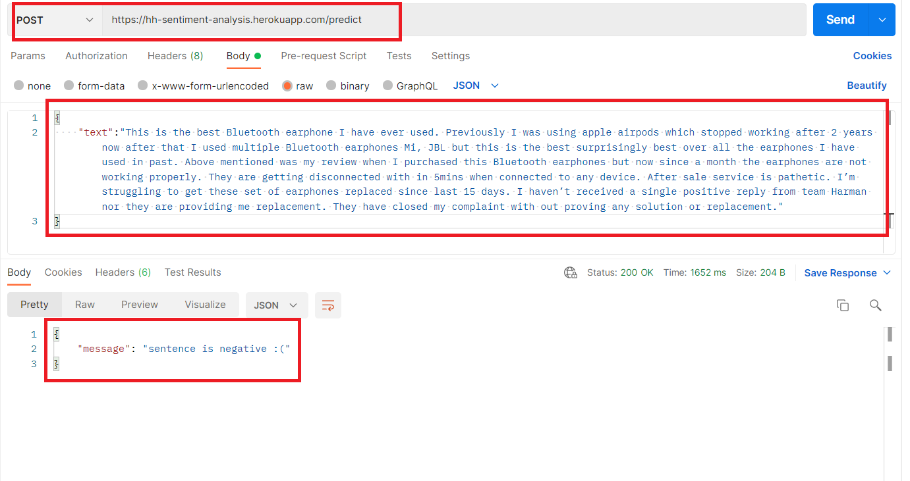

# Customer Review Labeling API

   

## Description

This API gives a label to the review text of a particular product or service, whether the review is positive or negative.

## Live End Point
to get live end point of api, [tap here](http://hh-sentiment-analysis.herokuapp.com/predict).

## Tech Stack

- Machine Learning, Python, Flask, sklearn

## API endpoint and data format

## Getting Started

- run flask app
- make post request on " /predict " end point with required data

## Project Admin

 

|  |
| :----------------------------------------------------------: |
| **[Parth Panchal](https://www.linkedin.com/in/parthpanchal8401/)**  |

  
Personal Portfolio : [hitchhicker.tech](hitchhicker.tech) 

